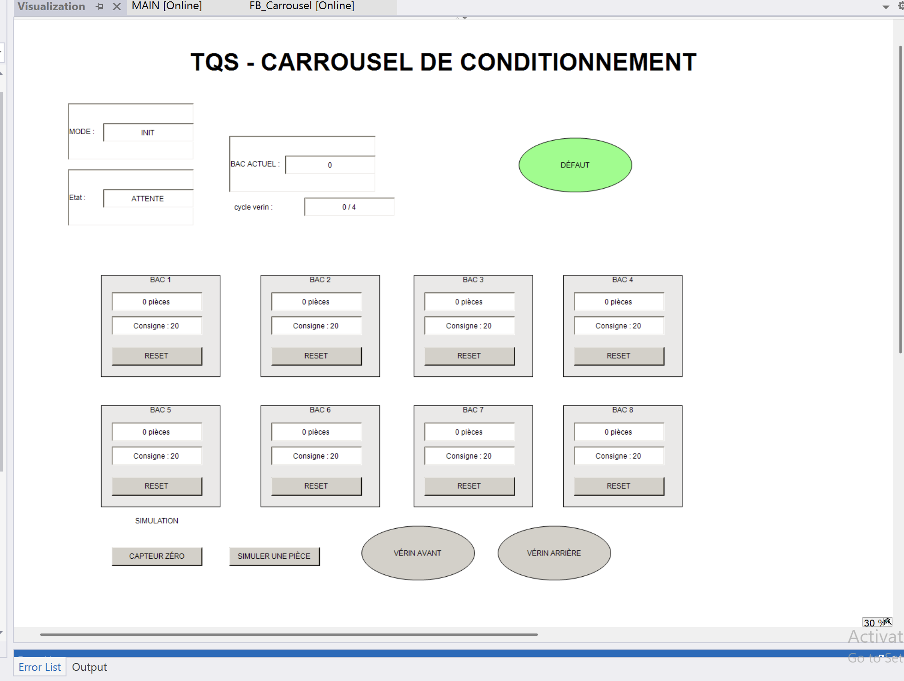
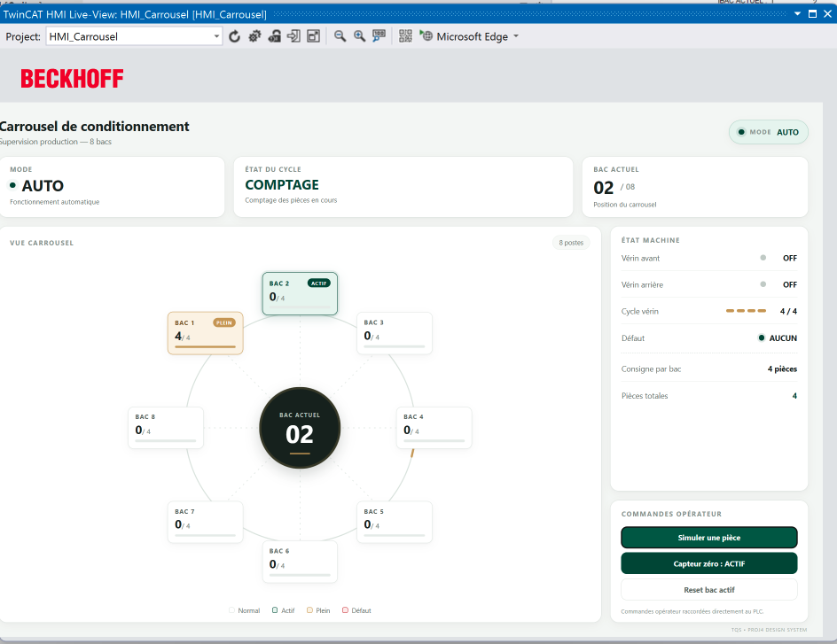

# TQS — Carrousel de conditionnement

Projet TwinCAT 3 réalisé à la suite d'un test technique pour un poste d'automaticien / développeur PLC.

Le périmètre initial porte sur le pilotage d'un carrousel de conditionnement à 8 bacs : comptage des pièces, indexation pneumatique, réinitialisations opérateur et traitement des cas limites. Deux interfaces ont ensuite été ajoutées à titre personnel pour faciliter la démonstration : une PLC Visualization V1 et une TwinCAT HMI V2.

## Organisation du dépôt

```text
TQS_Test_CHATER/
├── tqs/
│   ├── TQS_Test_CHATER.sln         # Solution commune PLC + TwinCAT HMI
│   ├── TQS_Test_CHATER.tnzip       # Archive propre des sources TwinCAT
│   ├── TQS_Test_CHATER/
│   │   ├── PLC_Carrousel/          # Programme automate et PLC Visualization V1
│   │   └── TQS_Test_CHATER.tsproj  # Projet TwinCAT XAE
│   └── HMI_Carrousel/              # Application TwinCAT HMI V2
├── docs/
│   ├── images/                     # Captures des deux interfaces
│   ├── rapport/                    # Sources LaTeX structurées
│   └── Rapport_TQS_Chater_Bach-char.pdf
├── .gitignore
└── README.md
```

La solution `tqs/TQS_Test_CHATER.sln` constitue le point d'entrée principal et référence les projets PLC et HMI avec des chemins relatifs.

## PLC

La logique métier est regroupée dans `FB_Carrousel`; `MAIN` assure les liaisons avec les entrées et les sorties.

- comptage sur front montant avec `R_TRIG` ;
- mémoire indépendante des 8 bacs ;
- indexation par 4 cycles complets du vérin ;
- modes `INIT`, `AUTO` et `DEFAUT` ;
- machine d'états du cycle automatique ;
- reset individuel ou global après un maintien de 10 s ;
- attente opérateur si le bac suivant est déjà plein ;
- contrôle des paramètres invalides et acquittement du défaut.

Les sources PLC se trouvent dans `tqs/TQS_Test_CHATER/PLC_Carrousel/` :

```text
PLC_Carrousel/
├── DUTs/       # E_ModeCarrousel, E_EtatCycle
├── POUs/       # MAIN, FB_Carrousel
├── VISUs/      # PLC Visualization V1
└── PlcTask.TcTTO
```

## Interfaces ajoutées après l'entretien

Les interfaces opérateur ne faisaient pas partie de la demande initiale. Elles constituent un complément personnel destiné à rendre le cycle observable et à faciliter les essais.

### PLC Visualization V1

La première interface est intégrée au projet PLC avec `VISUs/Visualization.TcVIS`. Elle sert à la supervision et aux essais dans TwinCAT XAE :

- mode, état courant, bac actif et avancement du cycle vérin ;
- compteurs et consigne des 8 bacs ;
- reset individuel des bacs ;
- indicateurs de défaut et de mouvement ;
- simulation du capteur zéro et du passage d'une pièce.



### TwinCAT HMI V2

La seconde interface est une application web TwinCAT HMI située dans `tqs/HMI_Carrousel/`. Elle reprend les données du PLC dans un tableau de bord responsive sans déplacer la logique machine hors de l'automate.

```text
PLC / FB_Carrousel
        │ symboles ADS
        ▼
PlcService
        ▼
CarouselController
        ├── DashboardView
        └── DashboardTemplate + TqsDashboard.css
```

- `PlcService.ts` encapsule la lecture, la surveillance et l'écriture des symboles ADS ;
- `CarouselController.ts` coordonne les échanges et les commandes opérateur ;
- `DashboardView.ts` met à jour l'affichage à partir de l'état du PLC ;
- `DashboardTemplate.ts` construit la structure du tableau de bord ;
- `Themes/Base/TqsDashboard.css` centralise le thème, les couleurs d'état et la mise en page responsive.



Cette V2 convient à la démonstration et à la simulation. Une qualification pour la production demanderait notamment une gestion complète des droits, des alarmes historisées et des exigences de sécurité machine.

## Rapport technique

Le [rapport final au format PDF](docs/Rapport_TQS_Chater_Bach-char.pdf) présente l'architecture TwinCAT, la machine d'états, le Structured Text, les essais et les cas limites. Les IHM réalisées après l'entretien sont documentées séparément du périmètre initial.

Les sources LaTeX sont versionnées dans `docs/rapport/`. Pour recompiler le rapport avec une distribution LaTeX complète :

```bash
cd docs/rapport
latexmk -pdf main.tex
```

Le PDF compilé dans `docs/rapport/main.pdf` reste local et est ignoré. Le document de référence est conservé sous `docs/Rapport_TQS_Chater_Bach-char.pdf`.

## Fichiers suivis et fichiers générés

Les sources PLC, les vues HMI, les fichiers TypeScript, les scripts JavaScript chargés par l'application, les configurations de projet et `TqsDashboard.css` sont conservés dans Git.

Les éléments reconstruits localement sont exclus : `Packages`, `.hmishare`, `bin`, `obj`, `_Boot`, `_CompileInfo`, `_Libraries`, fichiers `.tmc`, sauvegardes et temporaires. La configuration contenant le certificat TLS et sa clé privée locale n'est pas versionnée.

L'archive de référence `tqs/TQS_Test_CHATER.tnzip` constitue l'unique exception pour ce format. Elle est générée à partir de la version finale locale des sources suivies dans `tqs/`, puis contrôlée avant publication, sans inclure les paquets restaurés, les résultats de compilation ni les secrets locaux.

## Validation et ouverture du projet

Le projet PLC a été compilé, exécuté et testé sous TwinCAT 3 sur un runtime local. Les essais couvrent notamment le référencement, le comptage, l'indexation, le retour du bac 8 vers le bac 1, les resets et les paramètres invalides.

- solution : `tqs/TQS_Test_CHATER.sln` ;
- projet XAE : `tqs/TQS_Test_CHATER/TQS_Test_CHATER.tsproj` ;
- projet PLC : `tqs/TQS_Test_CHATER/PLC_Carrousel/PLC_Carrousel.plcproj` ;
- projet TwinCAT HMI : `tqs/HMI_Carrousel/HMI_Carrousel.hmiproj` ;
- archive TwinCAT vérifiée : `tqs/TQS_Test_CHATER.tnzip` ;
- rapport final : `docs/Rapport_TQS_Chater_Bach-char.pdf`.

---

**Chater Bach-char**  
Ingénieur systèmes numériques & instrumentation
